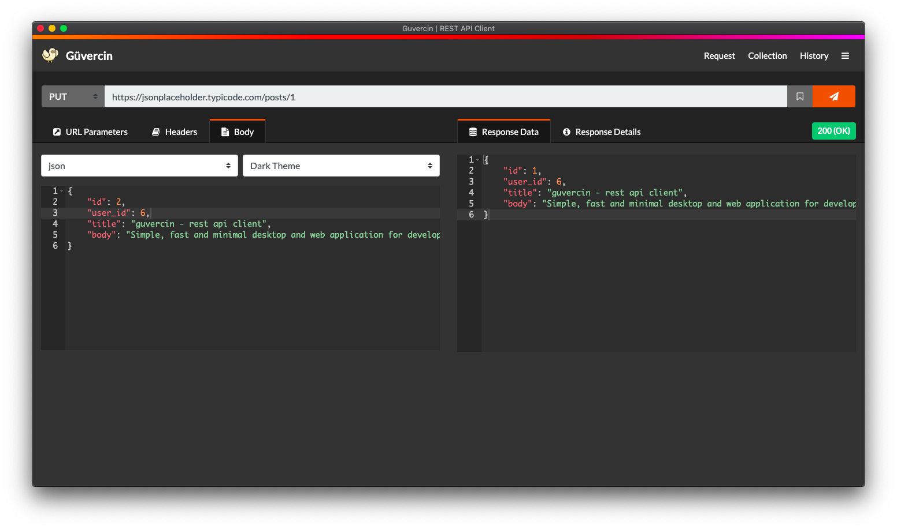
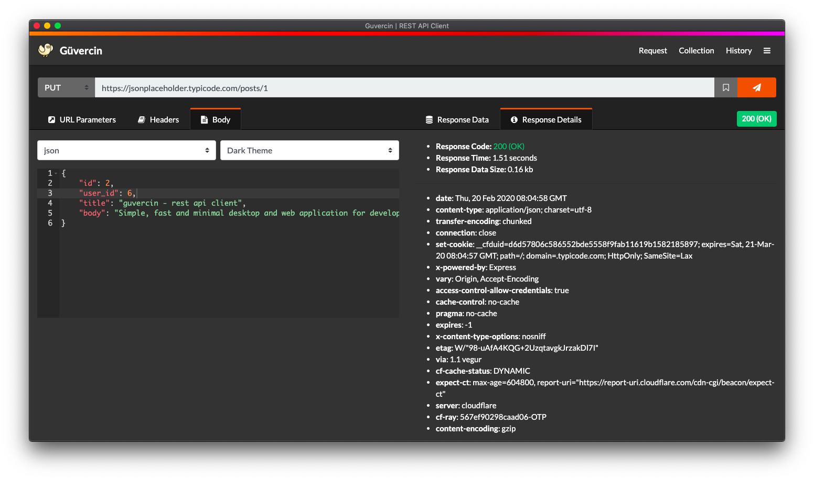
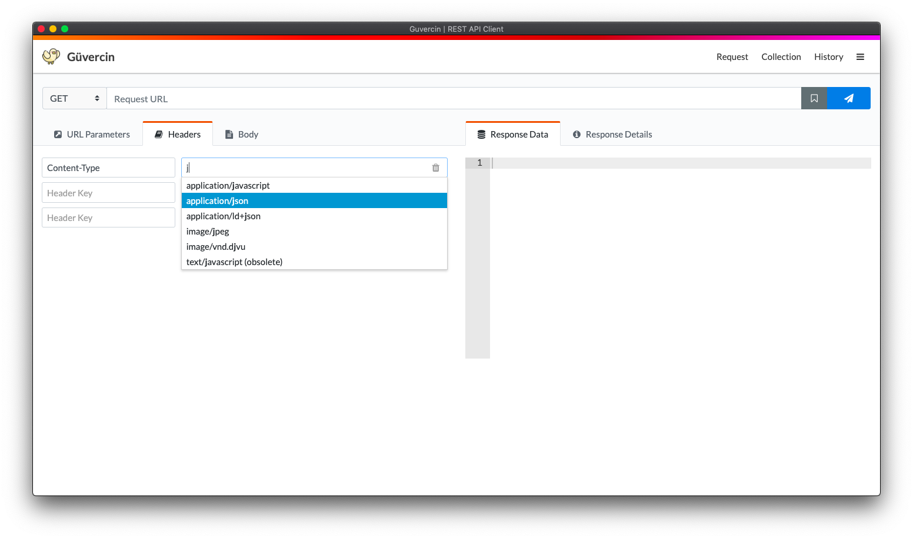
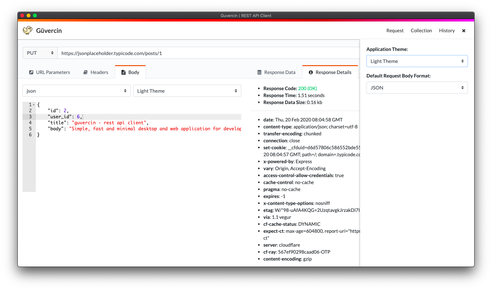
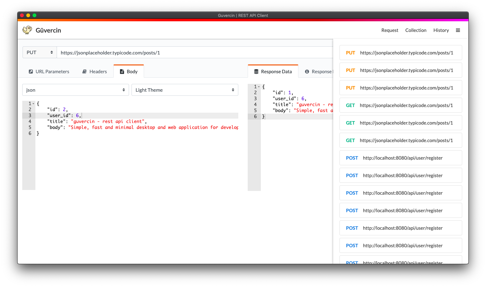

<h1>Welcome to Guvercin REST API Client 👋</h1>
<p>
  
  <a href="https://opensource.org/licenses/MIT" target="_blank">
    
  </a>
</p>

> Guvercin is Open Source Rest API Client App. Simple, fast and minimal desktop and web application for developers. Better than postman :)

## Install and Usage

<a href="https://snapcraft.io/guvercin">
  
</a>

```sh
git clone https://github.com/orcuntuna/guvercin.git
cd guvercin
npm install
npm start
```

## Screenshots








## Author

👤 **Orçun Tuna**

* Website: https://www.arkkod.com/
* Twitter: [@tunaorcun\_](https://twitter.com/tunaorcun\_)
* Github: [@orcuntuna](https://github.com/orcuntuna)

👤 **Murat Ahmet Korkmaz**

* Website: https://www.ahmetkorkmaz3.github.io/
* Twitter: [@ahmetmkorkmaz](https://twitter.com/ahmetmkorkmaz)
* Github: [@ahmetkorkmaz3](https://github.com/ahmetkorkmaz3)

## Show your support

Give a ⭐️ if this project helped you!

<a href="https://www.patreon.com/guvercin/">
  
</a>

## 📝 License

Copyright © 2020 [Orcun Tuna](https://github.com/orcuntuna).<br />
This project is [MIT](https://opensource.org/licenses/MIT) licensed.

***
_This README was generated with ❤️ by [readme-md-generator](https://github.com/kefranabg/readme-md-generator)_
